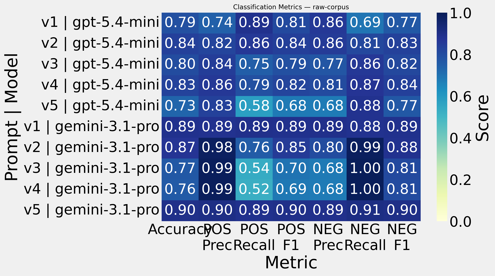
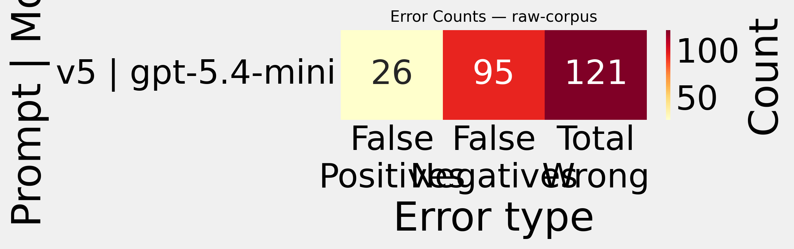
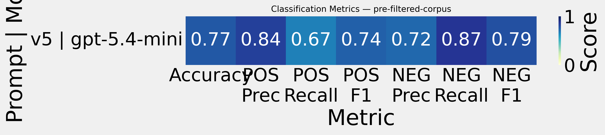
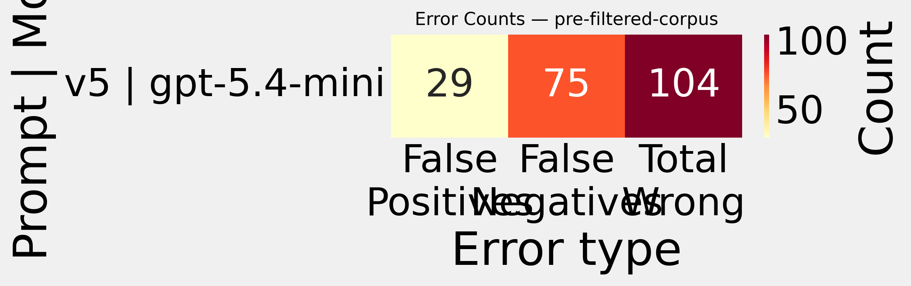

# Final Corpus — Results

> Auto-generated. Re-run `final_results.ipynb` to refresh.

## raw-corpus

### Prompt V1

```
Clasifica cada tweet como POSITIVE o NEGATIVE según estos criterios:

POSITIVE: cumple con uno o más de los siguientes:
- El usuario del tweet habla de cómo o qué tipo de droga ilícita está consumiendo.
- El usuario del tweet expresa la necesidad de consumir drogas ilícitas, ya sea por abstinencia o por gusto.
- El usuario añora consumir drogas ilícitas.

NEGATIVE: no cumple con ningún criterio POSITIVE, por ejemplo:
- Habla sobre noticias o información general sobre drogas ilícitas.
- Menciona drogas ilícitas sin relación con consumo problemático o necesidad.
- Expresa ironía o sarcasmo relacionado con drogas ilícitas.
```

| Model | Confusion Matrix | Classification Report | Wrong / Total |
|-------|-----------------|----------------------|--------------|
| gpt-5.4-mini | <table><tr><th></th><th>Pred NEG</th><th>Pred POS</th></tr><tr><th>True NEG</th><td>156</td><td>69</td></tr><tr><th>True POS</th><td>25</td><td>200</td></tr></table> | <table><tr><th>Label</th><th>Prec</th><th>Recall</th><th>F1</th></tr><tr><td>POSITIVE</td><td>0.74</td><td>0.89</td><td>0.81</td></tr><tr><td>NEGATIVE</td><td>0.86</td><td>0.69</td><td>0.77</td></tr><tr><td><b>Accuracy</b></td><td colspan='3'>0.79</td></tr></table> | 94 / 450 [CSV](/data/processed/final-corpus/raw-corpus/wct_gpt-5.4-mini-v1.csv) |
| gemini-3.1-pro | <table><tr><th></th><th>Pred NEG</th><th>Pred POS</th></tr><tr><th>True NEG</th><td>199</td><td>26</td></tr><tr><th>True POS</th><td>24</td><td>201</td></tr></table> | <table><tr><th>Label</th><th>Prec</th><th>Recall</th><th>F1</th></tr><tr><td>POSITIVE</td><td>0.89</td><td>0.89</td><td>0.89</td></tr><tr><td>NEGATIVE</td><td>0.89</td><td>0.88</td><td>0.89</td></tr><tr><td><b>Accuracy</b></td><td colspan='3'>0.89</td></tr></table> | 50 / 450 [CSV](/data/processed/final-corpus/raw-corpus/wct_gemini-3.1-pro-v1.csv) |

### Prompt V2

```
Clasifica cada tweet como POSITIVE o NEGATIVE según estos criterios:

POSITIVE: cumple con uno o más de los siguientes:
- El usuario del tweet habla de cómo o qué tipo de droga ilícita está consumiendo.
- El usuario del tweet expresa la necesidad de consumir drogas ilícitas, ya sea por abstinencia o por gusto.
- El usuario añora consumir drogas ilícitas.

NEGATIVE: no cumple con ningún criterio POSITIVE, por ejemplo:
- Habla sobre noticias o información general sobre drogas ilícitas.
- Menciona drogas ilícitas sin relación con consumo problemático o necesidad.
- Expresa ironía o sarcasmo relacionado con drogas ilícitas.

Tener en cuenta los siguientes aspectos:
- En el tweet puede estar presente la ironía o sarcasmo.
- El análisis se centra en el autor del tweet.
- Algunos tweets mencionan tomar una línea de colectivo, subte o tren, pero solamente esto no es condición suficiente para interpretarlo como una referencia al consumo de drogas ilícitas.
```

| Model | Confusion Matrix | Classification Report | Wrong / Total |
|-------|-----------------|----------------------|--------------|
| gpt-5.4-mini | <table><tr><th></th><th>Pred NEG</th><th>Pred POS</th></tr><tr><th>True NEG</th><td>183</td><td>42</td></tr><tr><th>True POS</th><td>31</td><td>194</td></tr></table> | <table><tr><th>Label</th><th>Prec</th><th>Recall</th><th>F1</th></tr><tr><td>POSITIVE</td><td>0.82</td><td>0.86</td><td>0.84</td></tr><tr><td>NEGATIVE</td><td>0.86</td><td>0.81</td><td>0.83</td></tr><tr><td><b>Accuracy</b></td><td colspan='3'>0.84</td></tr></table> | 73 / 450 [CSV](/data/processed/final-corpus/raw-corpus/wct_gpt-5.4-mini-v2.csv) |
| gemini-3.1-pro | <table><tr><th></th><th>Pred NEG</th><th>Pred POS</th></tr><tr><th>True NEG</th><td>222</td><td>3</td></tr><tr><th>True POS</th><td>55</td><td>170</td></tr></table> | <table><tr><th>Label</th><th>Prec</th><th>Recall</th><th>F1</th></tr><tr><td>POSITIVE</td><td>0.98</td><td>0.76</td><td>0.85</td></tr><tr><td>NEGATIVE</td><td>0.80</td><td>0.99</td><td>0.88</td></tr><tr><td><b>Accuracy</b></td><td colspan='3'>0.87</td></tr></table> | 58 / 450 [CSV](/data/processed/final-corpus/raw-corpus/wct_gemini-3.1-pro-v2.csv) |

### Prompt V3

```
Clasifica cada tweet como POSITIVE o NEGATIVE según estos criterios:

POSITIVE: cumple con uno o más de los siguientes:
- El autor describe que está consumiendo o ha consumido drogas ilícitas, y lo presenta de forma neutral o positiva.
- El autor expresa deseo, necesidad o anhelo de consumir drogas ilícitas.
- El autor manifiesta nostalgia por experiencias pasadas de consumo de drogas ilícitas.

NEGATIVE: no cumple con ningún criterio POSITIVE, por ejemplo:
- El autor menciona consumo propio pero lo critica o desaprueba.
- Describe consumo de otra persona (real o ficticia).
- Usa humor, ironía o sarcasmo sin implicar deseo o nostalgia real de consumo propio.
- Menciona drogas ilícitas en contextos informativos, ficticios o metafóricos.
- Habla de transporte público (colectivo, subte, tren) sin relación clara con drogas ilícitas.

Consideraciones:
- El foco está en consumo problemático del autor, no solo en cualquier mención de consumo.
- Ante ambigüedad, clasificar como NEGATIVE.
```

| Model | Confusion Matrix | Classification Report | Wrong / Total |
|-------|-----------------|----------------------|--------------|
| gpt-5.4-mini | <table><tr><th></th><th>Pred NEG</th><th>Pred POS</th></tr><tr><th>True NEG</th><td>194</td><td>31</td></tr><tr><th>True POS</th><td>57</td><td>168</td></tr></table> | <table><tr><th>Label</th><th>Prec</th><th>Recall</th><th>F1</th></tr><tr><td>POSITIVE</td><td>0.84</td><td>0.75</td><td>0.79</td></tr><tr><td>NEGATIVE</td><td>0.77</td><td>0.86</td><td>0.82</td></tr><tr><td><b>Accuracy</b></td><td colspan='3'>0.80</td></tr></table> | 88 / 450 [CSV](/data/processed/final-corpus/raw-corpus/wct_gpt-5.4-mini-v3.csv) |
| gemini-3.1-pro | <table><tr><th></th><th>Pred NEG</th><th>Pred POS</th></tr><tr><th>True NEG</th><td>224</td><td>1</td></tr><tr><th>True POS</th><td>104</td><td>121</td></tr></table> | <table><tr><th>Label</th><th>Prec</th><th>Recall</th><th>F1</th></tr><tr><td>POSITIVE</td><td>0.99</td><td>0.54</td><td>0.70</td></tr><tr><td>NEGATIVE</td><td>0.68</td><td>1.00</td><td>0.81</td></tr><tr><td><b>Accuracy</b></td><td colspan='3'>0.77</td></tr></table> | 105 / 450 [CSV](/data/processed/final-corpus/raw-corpus/wct_gemini-3.1-pro-v3.csv) |

### Prompt V4

```
Clasifica cada tweet como POSITIVE o NEGATIVE según estos criterios:

POSITIVE: cumple con uno o más de los siguientes:
- El autor indica explícitamente que consume o ha consumido drogas ilícitas y lo describe de forma neutral o positiva.
- El autor expresa deseo, necesidad o anhelo de consumir drogas ilícitas.
- El autor manifiesta nostalgia por consumo pasado, sin desaprobarlo.

NEGATIVE: no cumple con ningún criterio POSITIVE, por ejemplo:
- El autor menciona consumo propio pero lo desaprueba, lo critica o lo presenta como algo negativo.
- Contiene citas o menciones de consumo atribuibles a otra persona.
- Usa ironía, sarcasmo o lenguaje figurado sin implicar deseo o nostalgia real de consumo propio.
- Habla de drogas ilícitas en canciones, chistes, noticias o ficción.
- Usa expresiones como "tomar una línea" para referirse a transporte público, sin evidencia clara de drogas ilícitas.

Consideraciones:
- Si hay mezcla de experiencias propias y ajenas, clasificar como POSITIVE solo si el consumo problemático propio es explícito.
- Ante ambigüedad, clasificar como NEGATIVE.
```

| Model | Confusion Matrix | Classification Report | Wrong / Total |
|-------|-----------------|----------------------|--------------|
| gpt-5.4-mini | <table><tr><th></th><th>Pred NEG</th><th>Pred POS</th></tr><tr><th>True NEG</th><td>196</td><td>29</td></tr><tr><th>True POS</th><td>47</td><td>178</td></tr></table> | <table><tr><th>Label</th><th>Prec</th><th>Recall</th><th>F1</th></tr><tr><td>POSITIVE</td><td>0.86</td><td>0.79</td><td>0.82</td></tr><tr><td>NEGATIVE</td><td>0.81</td><td>0.87</td><td>0.84</td></tr><tr><td><b>Accuracy</b></td><td colspan='3'>0.83</td></tr></table> | 76 / 450 [CSV](/data/processed/final-corpus/raw-corpus/wct_gpt-5.4-mini-v4.csv) |
| gemini-3.1-pro | <table><tr><th></th><th>Pred NEG</th><th>Pred POS</th></tr><tr><th>True NEG</th><td>224</td><td>1</td></tr><tr><th>True POS</th><td>107</td><td>118</td></tr></table> | <table><tr><th>Label</th><th>Prec</th><th>Recall</th><th>F1</th></tr><tr><td>POSITIVE</td><td>0.99</td><td>0.52</td><td>0.69</td></tr><tr><td>NEGATIVE</td><td>0.68</td><td>1.00</td><td>0.81</td></tr><tr><td><b>Accuracy</b></td><td colspan='3'>0.76</td></tr></table> | 108 / 450 [CSV](/data/processed/final-corpus/raw-corpus/wct_gemini-3.1-pro-v4.csv) |

### Prompt V5

```
Clasifica cada tweet como POSITIVE o NEGATIVE aplicando esta jerarquía de reglas:

1. Si el autor afirma explícitamente que consume, ha consumido o desea consumir drogas ilícitas, y lo expresa de manera neutral o positiva → POSITIVE.
2. Si el autor menciona consumo propio pero con desaprobación, crítica o rechazo → NEGATIVE.
3. Si describe consumo de otra persona, real o ficticia → NEGATIVE.
4. Si es ambiguo y puede interpretarse de forma no problemática → NEGATIVE.
5. Si menciona drogas ilícitas en contextos humorísticos, ficticios, metafóricos o musicales, sin expresar deseo o nostalgia propia → NEGATIVE.
6. Si menciona "tomar una línea" en contexto de transporte público → NEGATIVE.

Definiciones:
- "Neutral o positiva" significa que el autor no expresa desaprobación o condena.
- "Nostalgia" implica recordar consumo pasado con añoranza o valoración positiva.
```

| Model | Confusion Matrix | Classification Report | Wrong / Total |
|-------|-----------------|----------------------|--------------|
| gpt-5.4-mini | <table><tr><th></th><th>Pred NEG</th><th>Pred POS</th></tr><tr><th>True NEG</th><td>199</td><td>26</td></tr><tr><th>True POS</th><td>95</td><td>130</td></tr></table> | <table><tr><th>Label</th><th>Prec</th><th>Recall</th><th>F1</th></tr><tr><td>POSITIVE</td><td>0.83</td><td>0.58</td><td>0.68</td></tr><tr><td>NEGATIVE</td><td>0.68</td><td>0.88</td><td>0.77</td></tr><tr><td><b>Accuracy</b></td><td colspan='3'>0.73</td></tr></table> | 121 / 450 [CSV](/data/processed/final-corpus/raw-corpus/wct_gpt-5.4-mini-v5.csv) |
| gemini-3.1-pro | <table><tr><th></th><th>Pred NEG</th><th>Pred POS</th></tr><tr><th>True NEG</th><td>204</td><td>21</td></tr><tr><th>True POS</th><td>25</td><td>200</td></tr></table> | <table><tr><th>Label</th><th>Prec</th><th>Recall</th><th>F1</th></tr><tr><td>POSITIVE</td><td>0.90</td><td>0.89</td><td>0.90</td></tr><tr><td>NEGATIVE</td><td>0.89</td><td>0.91</td><td>0.90</td></tr><tr><td><b>Accuracy</b></td><td colspan='3'>0.90</td></tr></table> | 46 / 450 [CSV](/data/processed/final-corpus/raw-corpus/wct_gemini-3.1-pro-v5.csv) |

### Summary





---

## pre-filtered-corpus

### Prompt V1

```
Clasifica cada tweet como POSITIVE o NEGATIVE según estos criterios:

POSITIVE: cumple con uno o más de los siguientes:
- El usuario del tweet habla de cómo o qué tipo de droga ilícita está consumiendo.
- El usuario del tweet expresa la necesidad de consumir drogas ilícitas, ya sea por abstinencia o por gusto.
- El usuario añora consumir drogas ilícitas.

NEGATIVE: no cumple con ningún criterio POSITIVE, por ejemplo:
- Habla sobre noticias o información general sobre drogas ilícitas.
- Menciona drogas ilícitas sin relación con consumo problemático o necesidad.
- Expresa ironía o sarcasmo relacionado con drogas ilícitas.
```

| Model | Confusion Matrix | Classification Report | Wrong / Total |
|-------|-----------------|----------------------|--------------|
| gpt-5.4-mini | <table><tr><th></th><th>Pred NEG</th><th>Pred POS</th></tr><tr><th>True NEG</th><td>161</td><td>64</td></tr><tr><th>True POS</th><td>18</td><td>207</td></tr></table> | <table><tr><th>Label</th><th>Prec</th><th>Recall</th><th>F1</th></tr><tr><td>POSITIVE</td><td>0.76</td><td>0.92</td><td>0.83</td></tr><tr><td>NEGATIVE</td><td>0.90</td><td>0.72</td><td>0.80</td></tr><tr><td><b>Accuracy</b></td><td colspan='3'>0.82</td></tr></table> | 82 / 450 [CSV](/data/processed/final-corpus/pre-filtered-corpus/wct_gpt-5.4-mini-v1.csv) |
| gemini-3.1-pro | <table><tr><th></th><th>Pred NEG</th><th>Pred POS</th></tr><tr><th>True NEG</th><td>223</td><td>2</td></tr><tr><th>True POS</th><td>92</td><td>133</td></tr></table> | <table><tr><th>Label</th><th>Prec</th><th>Recall</th><th>F1</th></tr><tr><td>POSITIVE</td><td>0.99</td><td>0.59</td><td>0.74</td></tr><tr><td>NEGATIVE</td><td>0.71</td><td>0.99</td><td>0.83</td></tr><tr><td><b>Accuracy</b></td><td colspan='3'>0.79</td></tr></table> | 94 / 450 [CSV](/data/processed/final-corpus/pre-filtered-corpus/wct_gemini-3.1-pro-v1.csv) |

### Prompt V2

```
Clasifica cada tweet como POSITIVE o NEGATIVE según estos criterios:

POSITIVE: cumple con uno o más de los siguientes:
- El usuario del tweet habla de cómo o qué tipo de droga ilícita está consumiendo.
- El usuario del tweet expresa la necesidad de consumir drogas ilícitas, ya sea por abstinencia o por gusto.
- El usuario añora consumir drogas ilícitas.

NEGATIVE: no cumple con ningún criterio POSITIVE, por ejemplo:
- Habla sobre noticias o información general sobre drogas ilícitas.
- Menciona drogas ilícitas sin relación con consumo problemático o necesidad.
- Expresa ironía o sarcasmo relacionado con drogas ilícitas.

Tener en cuenta los siguientes aspectos:
- En el tweet puede estar presente la ironía o sarcasmo.
- El análisis se centra en el autor del tweet.
- Algunos tweets mencionan tomar una línea de colectivo, subte o tren, pero solamente esto no es condición suficiente para interpretarlo como una referencia al consumo de drogas ilícitas.
```

| Model | Confusion Matrix | Classification Report | Wrong / Total |
|-------|-----------------|----------------------|--------------|
| gpt-5.4-mini | <table><tr><th></th><th>Pred NEG</th><th>Pred POS</th></tr><tr><th>True NEG</th><td>175</td><td>50</td></tr><tr><th>True POS</th><td>22</td><td>203</td></tr></table> | <table><tr><th>Label</th><th>Prec</th><th>Recall</th><th>F1</th></tr><tr><td>POSITIVE</td><td>0.80</td><td>0.90</td><td>0.85</td></tr><tr><td>NEGATIVE</td><td>0.89</td><td>0.78</td><td>0.83</td></tr><tr><td><b>Accuracy</b></td><td colspan='3'>0.84</td></tr></table> | 72 / 450 [CSV](/data/processed/final-corpus/pre-filtered-corpus/wct_gpt-5.4-mini-v2.csv) |
| gemini-3.1-pro | <table><tr><th></th><th>Pred NEG</th><th>Pred POS</th></tr><tr><th>True NEG</th><td>222</td><td>3</td></tr><tr><th>True POS</th><td>78</td><td>147</td></tr></table> | <table><tr><th>Label</th><th>Prec</th><th>Recall</th><th>F1</th></tr><tr><td>POSITIVE</td><td>0.98</td><td>0.65</td><td>0.78</td></tr><tr><td>NEGATIVE</td><td>0.74</td><td>0.99</td><td>0.85</td></tr><tr><td><b>Accuracy</b></td><td colspan='3'>0.82</td></tr></table> | 81 / 450 [CSV](/data/processed/final-corpus/pre-filtered-corpus/wct_gemini-3.1-pro-v2.csv) |

### Prompt V3

```
Clasifica cada tweet como POSITIVE o NEGATIVE según estos criterios:

POSITIVE: cumple con uno o más de los siguientes:
- El autor describe que está consumiendo o ha consumido drogas ilícitas, y lo presenta de forma neutral o positiva.
- El autor expresa deseo, necesidad o anhelo de consumir drogas ilícitas.
- El autor manifiesta nostalgia por experiencias pasadas de consumo de drogas ilícitas.

NEGATIVE: no cumple con ningún criterio POSITIVE, por ejemplo:
- El autor menciona consumo propio pero lo critica o desaprueba.
- Describe consumo de otra persona (real o ficticia).
- Usa humor, ironía o sarcasmo sin implicar deseo o nostalgia real de consumo propio.
- Menciona drogas ilícitas en contextos informativos, ficticios o metafóricos.
- Habla de transporte público (colectivo, subte, tren) sin relación clara con drogas ilícitas.

Consideraciones:
- El foco está en consumo problemático del autor, no solo en cualquier mención de consumo.
- Ante ambigüedad, clasificar como NEGATIVE.
```

| Model | Confusion Matrix | Classification Report | Wrong / Total |
|-------|-----------------|----------------------|--------------|
| gpt-5.4-mini | <table><tr><th></th><th>Pred NEG</th><th>Pred POS</th></tr><tr><th>True NEG</th><td>210</td><td>15</td></tr><tr><th>True POS</th><td>116</td><td>109</td></tr></table> | <table><tr><th>Label</th><th>Prec</th><th>Recall</th><th>F1</th></tr><tr><td>POSITIVE</td><td>0.88</td><td>0.48</td><td>0.62</td></tr><tr><td>NEGATIVE</td><td>0.64</td><td>0.93</td><td>0.76</td></tr><tr><td><b>Accuracy</b></td><td colspan='3'>0.71</td></tr></table> | 131 / 450 [CSV](/data/processed/final-corpus/pre-filtered-corpus/wct_gpt-5.4-mini-v3.csv) |
| gemini-3.1-pro | <table><tr><th></th><th>Pred NEG</th><th>Pred POS</th></tr><tr><th>True NEG</th><td>223</td><td>2</td></tr><tr><th>True POS</th><td>56</td><td>169</td></tr></table> | <table><tr><th>Label</th><th>Prec</th><th>Recall</th><th>F1</th></tr><tr><td>POSITIVE</td><td>0.99</td><td>0.75</td><td>0.85</td></tr><tr><td>NEGATIVE</td><td>0.80</td><td>0.99</td><td>0.88</td></tr><tr><td><b>Accuracy</b></td><td colspan='3'>0.87</td></tr></table> | 58 / 450 [CSV](/data/processed/final-corpus/pre-filtered-corpus/wct_gemini-3.1-pro-v3.csv) |

### Prompt V4

```
Clasifica cada tweet como POSITIVE o NEGATIVE según estos criterios:

POSITIVE: cumple con uno o más de los siguientes:
- El autor indica explícitamente que consume o ha consumido drogas ilícitas y lo describe de forma neutral o positiva.
- El autor expresa deseo, necesidad o anhelo de consumir drogas ilícitas.
- El autor manifiesta nostalgia por consumo pasado, sin desaprobarlo.

NEGATIVE: no cumple con ningún criterio POSITIVE, por ejemplo:
- El autor menciona consumo propio pero lo desaprueba, lo critica o lo presenta como algo negativo.
- Contiene citas o menciones de consumo atribuibles a otra persona.
- Usa ironía, sarcasmo o lenguaje figurado sin implicar deseo o nostalgia real de consumo propio.
- Habla de drogas ilícitas en canciones, chistes, noticias o ficción.
- Usa expresiones como "tomar una línea" para referirse a transporte público, sin evidencia clara de drogas ilícitas.

Consideraciones:
- Si hay mezcla de experiencias propias y ajenas, clasificar como POSITIVE solo si el consumo problemático propio es explícito.
- Ante ambigüedad, clasificar como NEGATIVE.
```

| Model | Confusion Matrix | Classification Report | Wrong / Total |
|-------|-----------------|----------------------|--------------|
| gpt-5.4-mini | <table><tr><th></th><th>Pred NEG</th><th>Pred POS</th></tr><tr><th>True NEG</th><td>193</td><td>32</td></tr><tr><th>True POS</th><td>50</td><td>175</td></tr></table> | <table><tr><th>Label</th><th>Prec</th><th>Recall</th><th>F1</th></tr><tr><td>POSITIVE</td><td>0.85</td><td>0.78</td><td>0.81</td></tr><tr><td>NEGATIVE</td><td>0.79</td><td>0.86</td><td>0.82</td></tr><tr><td><b>Accuracy</b></td><td colspan='3'>0.82</td></tr></table> | 82 / 450 [CSV](/data/processed/final-corpus/pre-filtered-corpus/wct_gpt-5.4-mini-v4.csv) |
| gemini-3.1-pro | <table><tr><th></th><th>Pred NEG</th><th>Pred POS</th></tr><tr><th>True NEG</th><td>223</td><td>2</td></tr><tr><th>True POS</th><td>66</td><td>159</td></tr></table> | <table><tr><th>Label</th><th>Prec</th><th>Recall</th><th>F1</th></tr><tr><td>POSITIVE</td><td>0.99</td><td>0.71</td><td>0.82</td></tr><tr><td>NEGATIVE</td><td>0.77</td><td>0.99</td><td>0.87</td></tr><tr><td><b>Accuracy</b></td><td colspan='3'>0.85</td></tr></table> | 68 / 450 [CSV](/data/processed/final-corpus/pre-filtered-corpus/wct_gemini-3.1-pro-v4.csv) |

### Prompt V5

```
Clasifica cada tweet como POSITIVE o NEGATIVE aplicando esta jerarquía de reglas:

1. Si el autor afirma explícitamente que consume, ha consumido o desea consumir drogas ilícitas, y lo expresa de manera neutral o positiva → POSITIVE.
2. Si el autor menciona consumo propio pero con desaprobación, crítica o rechazo → NEGATIVE.
3. Si describe consumo de otra persona, real o ficticia → NEGATIVE.
4. Si es ambiguo y puede interpretarse de forma no problemática → NEGATIVE.
5. Si menciona drogas ilícitas en contextos humorísticos, ficticios, metafóricos o musicales, sin expresar deseo o nostalgia propia → NEGATIVE.
6. Si menciona "tomar una línea" en contexto de transporte público → NEGATIVE.

Definiciones:
- "Neutral o positiva" significa que el autor no expresa desaprobación o condena.
- "Nostalgia" implica recordar consumo pasado con añoranza o valoración positiva.
```

| Model | Confusion Matrix | Classification Report | Wrong / Total |
|-------|-----------------|----------------------|--------------|
| gpt-5.4-mini | <table><tr><th></th><th>Pred NEG</th><th>Pred POS</th></tr><tr><th>True NEG</th><td>196</td><td>29</td></tr><tr><th>True POS</th><td>75</td><td>150</td></tr></table> | <table><tr><th>Label</th><th>Prec</th><th>Recall</th><th>F1</th></tr><tr><td>POSITIVE</td><td>0.84</td><td>0.67</td><td>0.74</td></tr><tr><td>NEGATIVE</td><td>0.72</td><td>0.87</td><td>0.79</td></tr><tr><td><b>Accuracy</b></td><td colspan='3'>0.77</td></tr></table> | 104 / 450 [CSV](/data/processed/final-corpus/pre-filtered-corpus/wct_gpt-5.4-mini-v5.csv) |
| gemini-3.1-pro | <table><tr><th></th><th>Pred NEG</th><th>Pred POS</th></tr><tr><th>True NEG</th><td>222</td><td>3</td></tr><tr><th>True POS</th><td>47</td><td>178</td></tr></table> | <table><tr><th>Label</th><th>Prec</th><th>Recall</th><th>F1</th></tr><tr><td>POSITIVE</td><td>0.98</td><td>0.79</td><td>0.88</td></tr><tr><td>NEGATIVE</td><td>0.83</td><td>0.99</td><td>0.90</td></tr><tr><td><b>Accuracy</b></td><td colspan='3'>0.89</td></tr></table> | 50 / 450 [CSV](/data/processed/final-corpus/pre-filtered-corpus/wct_gemini-3.1-pro-v5.csv) |

### Summary





---

## Overall Summary

Both corpora contain **450 tweets (225 POSITIVE / 225 NEGATIVE)**, tested across 5 prompt versions and 2 models.

### raw-corpus

| Version | GPT-5.4-mini Acc | GPT POS F1 | GPT NEG F1 | GPT Wrong | Gemini Acc | Gemini POS F1 | Gemini NEG F1 | Gemini Wrong |
|---------|-----------------|------------|------------|-----------|------------|---------------|---------------|--------------|
| v1 | 0.791 | 0.81 | 0.77 | 94 | **0.889** | **0.89** | **0.89** | **50** |
| v2 | 0.838 | 0.84 | 0.83 | 73 | 0.871 | 0.85 | 0.88 | 58 |
| v3 | 0.804 | 0.79 | 0.82 | 88 | 0.767 | 0.70 | 0.81 | 105 |
| v4 | 0.831 | 0.82 | 0.84 | 76 | 0.760 | 0.69 | 0.81 | 108 |
| v5 | 0.731 | 0.68 | 0.77 | 121 | 0.898 | 0.90 | 0.90 | **46** |

### pre-filtered-corpus

| Version | GPT-5.4-mini Acc | GPT POS F1 | GPT NEG F1 | GPT Wrong | Gemini Acc | Gemini POS F1 | Gemini NEG F1 | Gemini Wrong |
|---------|-----------------|------------|------------|-----------|------------|---------------|---------------|--------------|
| v1 | 0.818 | 0.84 | 0.80 | 82 | 0.791 | 0.74 | 0.83 | 94 |
| v2 | **0.840** | **0.85** | **0.83** | **72** | 0.820 | 0.78 | 0.85 | 81 |
| v3 | 0.709 | 0.63 | 0.76 | 131 | 0.871 | 0.85 | 0.89 | 58 |
| v4 | 0.818 | 0.81 | 0.83 | 82 | 0.849 | 0.82 | 0.87 | 68 |
| v5 | 0.769 | 0.74 | 0.79 | 104 | **0.889** | **0.88** | **0.90** | **50** |

### Key findings

- **Gemini 3.1 Pro significantly outperforms GPT-5.4-mini** overall, achieving up to 89.8% accuracy vs 83.8% for GPT.
- **Gemini's best prompt is v5** (hierarchical rules) on both corpora — the opposite of GPT, where v5 was the worst. Gemini handles strict, explicit rules better.
- **GPT's best prompt remains v2** on both corpora — simpler criteria with a few clarifying notes generalise best for GPT in batch mode.
- **Gemini v3 and v4 perform poorly on raw-corpus** (FN-heavy: near-zero false positives but many missed POSITIVE tweets), suggesting it over-applies the stricter criteria on noisier data.
- **Pre-filtered corpus advantage is model-dependent**: GPT benefits from pre-filtering across all versions; Gemini shows mixed results, performing better on raw-corpus for v1 and v5.
- **Gemini's dominant error is false negatives** (misses POSITIVE tweets) — very high precision but lower recall for POSITIVE, especially on v3/v4.
- **Best single result overall: Gemini v5 on raw-corpus** — 89.8% accuracy, 46 errors, near-perfectly balanced F1 (0.90 / 0.90).
