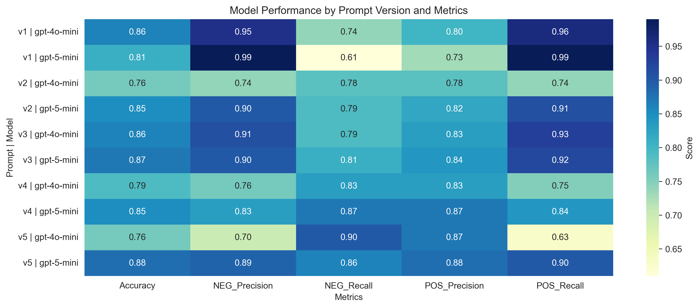
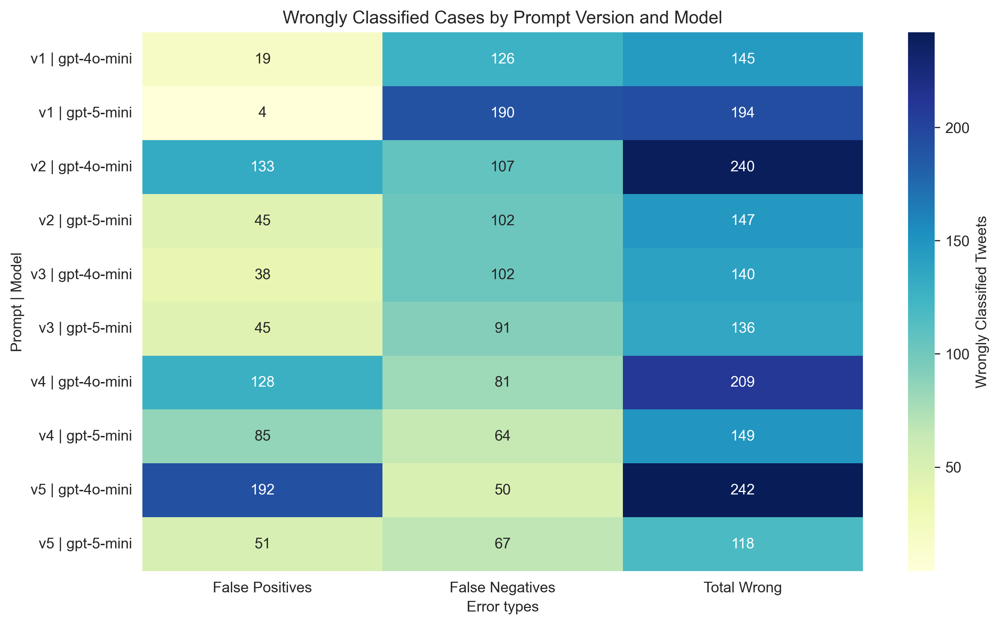

# Results

Many tests were made to try to answer the following question:

> **Do the OpenAI models already know to classify if a tweet is talking about drug consumption AHB?**

Results:
- [Prompt V1](#prompt-v1)
- [Prompt V2](#prompt-v2)
- [Prompt V3](#prompt-v3)
- [Prompt V4](#prompt-v4)
- [Prompt V5](#prompt-v5)


## Prompt v1

```
Clasifica el siguiente tweet como POSITIVE o NEGATIVE según estos criterios:

    POSITIVE: cumple con uno o más de los siguientes:
    - El usuario del tweet habla de cómo o qué tipo de droga ilícita está consumiendo.
    - El usuario del tweet expresa la necesidad de consumir drogas ilícitas, ya sea por abstinencia o por gusto.
    - El usuario añora consumir drogas ilícitas.

    NEGATIVE: no cumple con ningún criterio POSITIVE, por ejemplo:
    - Habla sobre noticias o información general sobre drogas ilícitas.
    - Menciona drogas ilícitas sin relación con consumo problemático o necesidad.
    - Expresa ironía o sarcasmo relacionado con drogas ilícitas.

    Responde únicamente con la palabra POSITIVE o NEGATIVE, sin añadir explicaciones ni otro texto.

    Tweet: {tweet}
```

### Tests

| Model | Confusion Matrix | Classification Report | Wrong Cases |
| ----- | ---------------- | --------------------- | ----------- |
| gpt-4o-mini | <table><tr><th></th><th>Predicted Neg</th><th>Predicted Pos</th></tr><tr><th>Actual Neg</th><td>502</td><td>19</td></tr><tr><th>Actual Pos</th><td>126</td><td>362</td></tr></table> | <table><tr><th>Label</th><th>Precision</th><th>Recall</th><th>F1-score</th><th>Support</th></tr><tr><td>POSITIVE</td><td>0.80</td><td>0.96</td><td>0.87</td><td>488</td></tr><tr><td>NEGATIVE</td><td>0.95</td><td>0.74</td><td>0.83</td><td>521</td></tr><tr><td><b>Accuracy</b></td><td colspan='3'>0.86</td><td>504</td></tr><tr><td>Macro avg</td><td>0.88</td><td>0.85</td><td>0.85</td><td>504</td></tr><tr><td>Weighted avg</td><td>1.76</td><td>1.69</td><td>1.71</td><td>504</td></tr></table> | 145 cases <br/> [CSV](/data/processed/wct_gpt-4o-mini-v1.csv) |
| gpt-5-mini | <table><tr><th></th><th>Predicted Neg</th><th>Predicted Pos</th></tr><tr><th>Actual Neg</th><td>517</td><td>4</td></tr><tr><th>Actual Pos</th><td>190</td><td>298</td></tr></table> | <table><tr><th>Label</th><th>Precision</th><th>Recall</th><th>F1-score</th><th>Support</th></tr><tr><td>POSITIVE</td><td>0.73</td><td>0.99</td><td>0.84</td><td>488</td></tr><tr><td>NEGATIVE</td><td>0.99</td><td>0.61</td><td>0.75</td><td>521</td></tr><tr><td><b>Accuracy</b></td><td colspan='3'>0.81</td><td>504</td></tr><tr><td>Macro avg</td><td>0.86</td><td>0.80</td><td>0.80</td><td>504</td></tr><tr><td>Weighted avg</td><td>1.73</td><td>1.59</td><td>1.59</td><td>504</td></tr></table> | 194 cases <br/> [CSV](/data/processed/wct_gpt-5-mini-v1.csv) |

---

## Prompt v2

```
Clasifica el siguiente tweet como POSITIVE o NEGATIVE según estos criterios:

    POSITIVE: cumple con uno o más de los siguientes:
    - El usuario del tweet habla de cómo o qué tipo de droga ilícita está consumiendo.
    - El usuario del tweet expresa la necesidad de consumir drogas ilícitas, ya sea por abstinencia o por gusto.
    - El usuario añora consumir drogas ilícitas.

    NEGATIVE: no cumple con ningún criterio POSITIVE, por ejemplo:
    - Habla sobre noticias o información general sobre drogas ilícitas.
    - Menciona drogas ilícitas sin relación con consumo problemático o necesidad.
    - Expresa ironía o sarcasmo relacionado con drogas ilícitas.

    Tener en cuenta los siguientes aspectos:
    - En el tweet puede estar presente la ironía o sarcasmo.
    - El análisis se centra en el autor del tweet. Por ejemplo, si el tweet cita a otro usuario y le pregunta si ha consumido drogas, o si habla en nombre de otro usuario mencionando que ese usuario consume drogas, la clasificación del tweet debe ser NEGATIVE, ya que el contenido no involucra directamente al autor.
    - Algunos tweets mencionan tomar una línea de colectivo, subte o tren, pero solamente esto, no es condición suficiente para interpretarlo como una referencia al consumo de drogas ilícitas.

    Responde únicamente con la palabra POSITIVE o NEGATIVE, sin añadir explicaciones ni otro texto.

    Tweet: {tweet}
```

### Tests

| Model | Confusion Matrix | Classification Report | Wrong Cases |
| ----- | ---------------- | --------------------- | ----------- |
| gpt-4o-mini | <table><tr><th></th><th>Predicted Neg</th><th>Predicted Pos</th></tr><tr><th>Actual Neg</th><td>388</td><td>133</td></tr><tr><th>Actual Pos</th><td>107</td><td>381</td></tr></table> | <table><tr><th>Label</th><th>Precision</th><th>Recall</th><th>F1-score</th><th>Support</th></tr><tr><td>POSITIVE</td><td>0.78</td><td>0.74</td><td>0.76</td><td>488</td></tr><tr><td>NEGATIVE</td><td>0.74</td><td>0.78</td><td>0.76</td><td>521</td></tr><tr><td><b>Accuracy</b></td><td colspan='3'>0.76</td><td>504</td></tr><tr><td>Macro avg</td><td>0.76</td><td>0.76</td><td>0.76</td><td>504</td></tr><tr><td>Weighted avg</td><td>1.52</td><td>1.52</td><td>1.52</td><td>504</td></tr></table> | 240 cases <br/> [CSV](/data/processed/wct_gpt-4o-mini-v2.csv) |
| gpt-5-mini | <table><tr><th></th><th>Predicted Neg</th><th>Predicted Pos</th></tr><tr><th>Actual Neg</th><td>476</td><td>45</td></tr><tr><th>Actual Pos</th><td>102</td><td>386</td></tr></table> | <table><tr><th>Label</th><th>Precision</th><th>Recall</th><th>F1-score</th><th>Support</th></tr><tr><td>POSITIVE</td><td>0.82</td><td>0.91</td><td>0.86</td><td>488</td></tr><tr><td>NEGATIVE</td><td>0.90</td><td>0.79</td><td>0.84</td><td>521</td></tr><tr><td><b>Accuracy</b></td><td colspan='3'>0.85</td><td>504</td></tr><tr><td>Macro avg</td><td>0.86</td><td>0.85</td><td>0.85</td><td>504</td></tr><tr><td>Weighted avg</td><td>1.72</td><td>1.70</td><td>1.71</td><td>504</td></tr></table> | 147 cases <br/> [CSV](/data/processed/wct_gpt-5-mini-v2.csv) |

---

## Prompt v3

```
Clasifica el siguiente tweet como POSITIVE o NEGATIVE según estos criterios:

    POSITIVE: cumple con uno o más de los siguientes:
    - El autor describe que está consumiendo o ha consumido drogas ilícitas, y lo presenta de forma neutral o positiva.
    - El autor expresa deseo, necesidad o anhelo de consumir drogas ilícitas.
    - El autor manifiesta nostalgia por experiencias pasadas de consumo de drogas ilícitas.

    NEGATIVE: no cumple con ningún criterio POSITIVE, por ejemplo:
    - El autor menciona consumo propio pero lo critica o desaprueba.
    - Describe consumo de otra persona (real o ficticia).
    - Usa humor, ironía o sarcasmo sin implicar deseo o nostalgia real de consumo propio.
    - Menciona drogas ilícitas en contextos informativos, ficticios o metafóricos.
    - Habla de transporte público (colectivo, subte, tren) sin relación clara con drogas ilícitas.

    Consideraciones:
    - El foco está en consumo problemático del autor, no solo en cualquier mención de consumo.
    - Ante ambigüedad, clasificar como NEGATIVE.

    Responde únicamente con POSITIVE o NEGATIVE.

    Tweet: {tweet}
```

### Tests

| Model | Confusion Matrix | Classification Report | Wrong Cases |
| ----- | ---------------- | --------------------- | ----------- |
| gpt-4o-mini | <table><tr><th></th><th>Predicted Neg</th><th>Predicted Pos</th></tr><tr><th>Actual Neg</th><td>483</td><td>38</td></tr><tr><th>Actual Pos</th><td>102</td><td>386</td></tr></table> | <table><tr><th>Label</th><th>Precision</th><th>Recall</th><th>F1-score</th><th>Support</th></tr><tr><td>POSITIVE</td><td>0.83</td><td>0.93</td><td>0.88</td><td>488</td></tr><tr><td>NEGATIVE</td><td>0.91</td><td>0.79</td><td>0.85</td><td>521</td></tr><tr><td><b>Accuracy</b></td><td colspan='3'>0.86</td><td>504</td></tr><tr><td>Macro avg</td><td>0.87</td><td>0.86</td><td>0.86</td><td>504</td></tr><tr><td>Weighted avg</td><td>1.74</td><td>1.72</td><td>1.72</td><td>504</td></tr></table> | 140 cases <br/> [CSV](/data/processed/wct_gpt-4o-mini-v3.csv) |
| gpt-5-mini | <table><tr><th></th><th>Predicted Neg</th><th>Predicted Pos</th></tr><tr><th>Actual Neg</th><td>477</td><td>45</td></tr><tr><th>Actual Pos</th><td>91</td><td>397</td></tr></table> | <table><tr><th>Label</th><th>Precision</th><th>Recall</th><th>F1-score</th><th>Support</th></tr><tr><td>POSITIVE</td><td>0.84</td><td>0.92</td><td>0.88</td><td>488</td></tr><tr><td>NEGATIVE</td><td>0.90</td><td>0.81</td><td>0.85</td><td>522</td></tr><tr><td><b>Accuracy</b></td><td colspan='3'>0.87</td><td>505</td></tr><tr><td>Macro avg</td><td>0.87</td><td>0.86</td><td>0.87</td><td>505</td></tr><tr><td>Weighted avg</td><td>1.74</td><td>1.73</td><td>1.73</td><td>505</td></tr></table> | 136 cases <br/> [CSV](/data/processed/wct_gpt-5-mini-v3.csv) |

---

## Prompt v4

```
Clasifica el siguiente tweet como POSITIVE o NEGATIVE según estos criterios:

    POSITIVE: cumple con uno o más de los siguientes:
    - El autor indica explícitamente que consume o ha consumido drogas ilícitas y lo describe de forma neutral o positiva.
    - El autor expresa deseo, necesidad o anhelo de consumir drogas ilícitas.
    - El autor manifiesta nostalgia por consumo pasado, sin desaprobarlo.

    NEGATIVE: no cumple con ningún criterio POSITIVE, por ejemplo:
    - El autor menciona consumo propio pero lo desaprueba, lo critica o lo presenta como algo negativo.
    - Contiene citas o menciones de consumo atribuibles a otra persona.
    - Usa ironía, sarcasmo o lenguaje figurado sin implicar deseo o nostalgia real de consumo propio.
    - Habla de drogas ilícitas en canciones, chistes, noticias o ficción.
    - Usa expresiones como “tomar una línea” para referirse a transporte público, sin evidencia clara de drogas ilícitas.

    Consideraciones:
    - Si hay mezcla de experiencias propias y ajenas, clasificar como POSITIVE solo si el consumo problemático propio es explícito.
    - Ante ambigüedad, clasificar como NEGATIVE.

    Responde únicamente con POSITIVE o NEGATIVE.

    Tweet: {tweet}
```

### Tests

| Model | Confusion Matrix | Classification Report | Wrong Cases |
| ----- | ---------------- | --------------------- | ----------- |
| gpt-4o-mini | <table><tr><th></th><th>Predicted Neg</th><th>Predicted Pos</th></tr><tr><th>Actual Neg</th><td>393</td><td>128</td></tr><tr><th>Actual Pos</th><td>81</td><td>407</td></tr></table> | <table><tr><th>Label</th><th>Precision</th><th>Recall</th><th>F1-score</th><th>Support</th></tr><tr><td>POSITIVE</td><td>0.83</td><td>0.75</td><td>0.79</td><td>488</td></tr><tr><td>NEGATIVE</td><td>0.76</td><td>0.83</td><td>0.79</td><td>521</td></tr><tr><td><b>Accuracy</b></td><td colspan='3'>0.79</td><td>504</td></tr><tr><td>Macro avg</td><td>0.79</td><td>0.79</td><td>0.79</td><td>504</td></tr><tr><td>Weighted avg</td><td>1.59</td><td>1.58</td><td>1.58</td><td>504</td></tr></table> | 209 cases <br/> [CSV](/data/processed/wct_gpt-4o-mini-v4.csv) |
| gpt-5-mini | <table><tr><th></th><th>Predicted Neg</th><th>Predicted Pos</th></tr><tr><th>Actual Neg</th><td>436</td><td>85</td></tr><tr><th>Actual Pos</th><td>64</td><td>424</td></tr></table> | <table><tr><th>Label</th><th>Precision</th><th>Recall</th><th>F1-score</th><th>Support</th></tr><tr><td>POSITIVE</td><td>0.87</td><td>0.84</td><td>0.85</td><td>488</td></tr><tr><td>NEGATIVE</td><td>0.83</td><td>0.87</td><td>0.85</td><td>521</td></tr><tr><td><b>Accuracy</b></td><td colspan='3'>0.85</td><td>504</td></tr><tr><td>Macro avg</td><td>0.85</td><td>0.85</td><td>0.85</td><td>504</td></tr><tr><td>Weighted avg</td><td>1.70</td><td>1.71</td><td>1.71</td><td>504</td></tr></table> | 149 cases <br/> [CSV](/data/processed/wct_gpt-5-mini-v4.csv) |

---

## Prompt v5

```
Clasifica el siguiente tweet como POSITIVE o NEGATIVE aplicando esta jerarquía de reglas:

    1. Si el autor afirma explícitamente que consume, ha consumido o desea consumir drogas ilícitas, y lo expresa de manera neutral o positiva → POSITIVE.
    2. Si el autor menciona consumo propio pero con desaprobación, crítica o rechazo → NEGATIVE.
    3. Si describe consumo de otra persona, real o ficticia → NEGATIVE.
    4. Si es ambiguo y puede interpretarse de forma no problemática → NEGATIVE.
    5. Si menciona drogas ilícitas en contextos humorísticos, ficticios, metafóricos o musicales, sin expresar deseo o nostalgia propia → NEGATIVE.
    6. Si menciona “tomar una línea” en contexto de transporte público → NEGATIVE.

    Definiciones:
    - “Neutral o positiva” significa que el autor no expresa desaprobación o condena.
    - “Nostalgia” implica recordar consumo pasado con añoranza o valoración positiva.

    Responde únicamente con POSITIVE o NEGATIVE.

    Tweet: {tweet}
```

### Tests

| Model | Confusion Matrix | Classification Report | Wrong Cases |
| ----- | ---------------- | --------------------- | ----------- |
| gpt-4o-mini | <table><tr><th></th><th>Predicted Neg</th><th>Predicted Pos</th></tr><tr><th>Actual Neg</th><td>329</td><td>192</td></tr><tr><th>Actual Pos</th><td>50</td><td>438</td></tr></table> | <table><tr><th>Label</th><th>Precision</th><th>Recall</th><th>F1-score</th><th>Support</th></tr><tr><td>POSITIVE</td><td>0.87</td><td>0.63</td><td>0.73</td><td>488</td></tr><tr><td>NEGATIVE</td><td>0.70</td><td>0.90</td><td>0.79</td><td>521</td></tr><tr><td><b>Accuracy</b></td><td colspan='3'>0.76</td><td>504</td></tr><tr><td>Macro avg</td><td>0.78</td><td>0.77</td><td>0.76</td><td>504</td></tr><tr><td>Weighted avg</td><td>1.57</td><td>1.54</td><td>1.52</td><td>504</td></tr></table> | 242 cases <br/> [CSV](/data/processed/wct_gpt-4o-mini-v5.csv) |
| gpt-5-mini | <table><tr><th></th><th>Predicted Neg</th><th>Predicted Pos</th></tr><tr><th>Actual Neg</th><td>470</td><td>51</td></tr><tr><th>Actual Pos</th><td>67</td><td>421</td></tr></table> | <table><tr><th>Label</th><th>Precision</th><th>Recall</th><th>F1-score</th><th>Support</th></tr><tr><td>POSITIVE</td><td>0.88</td><td>0.90</td><td>0.89</td><td>488</td></tr><tr><td>NEGATIVE</td><td>0.89</td><td>0.86</td><td>0.87</td><td>521</td></tr><tr><td><b>Accuracy</b></td><td colspan='3'>0.88</td><td>504</td></tr><tr><td>Macro avg</td><td>0.89</td><td>0.88</td><td>0.88</td><td>504</td></tr><tr><td>Weighted avg</td><td>1.77</td><td>1.76</td><td>1.77</td><td>504</td></tr></table> | 118 cases <br/> [CSV](/data/processed/wct_gpt-5-mini-v5.csv) |

---

## Summary





