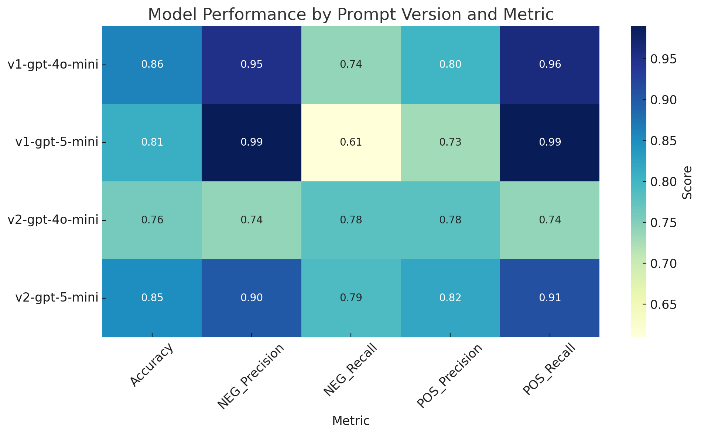
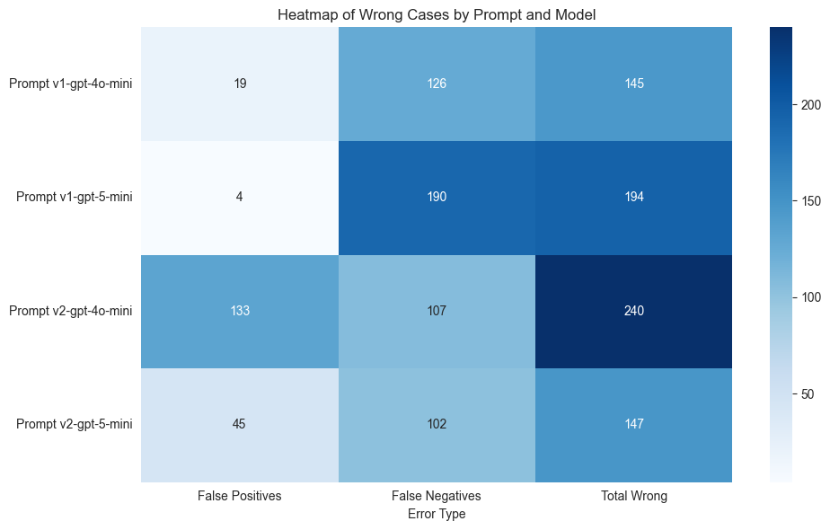

# Results

Many tests were made to try to answer the following question:

> **Do the OpenAI models already know to classify if a tweet is talking about drug consumption AHB?**

Results:
- [Prompt V1](#prompt-v1)
- [Prompt V2](#prompt-v2)


## Prompt v1

```
Clasifica el siguiente tweet como POSITIVE o NEGATIVE según estos criterios:

POSITIVE: cumple con uno o más de los siguientes:
- El usuario del tweet habla de cómo o qué tipo de droga ilícita está consumiendo.
- El usuario del tweet expresa la necesidad de consumir drogas ilícitas, ya sea por abstinencia o por gusto.
- El usuario añora consumir drogas ilícitas.

NEGATIVE: no cumple con ningún criterio POSITIVE, por ejemplo:
- Habla sobre noticias o información general sobre drogas ilícitas.
- Menciona drogas ilícitas sin relación con consumo problemático o necesidad.
- Expresa ironía o sarcasmo relacionado con drogas ilícitas.

Responde únicamente con la palabra POSITIVE o NEGATIVE, sin añadir explicaciones ni otro texto.

Tweet: {tweet}
```

### Tests

| Model       | Confusion Matrix                                                                                                                                                                     | Classification Report                                                                                                                                                                                                                                                                                                                                                                                                                                                                                      | Wrong Cases                                                   |
| ----------- | ------------------------------------------------------------------------------------------------------------------------------------------------------------------------------------ | ---------------------------------------------------------------------------------------------------------------------------------------------------------------------------------------------------------------------------------------------------------------------------------------------------------------------------------------------------------------------------------------------------------------------------------------------------------------------------------------------------------- |---------------------------------------------------------------|
| gpt-4o-mini | <table><tr><th></th><th>Predicted Neg</th><th>Predicted Pos</th></tr><tr><th>Actual Neg</th><td>502</td><td>19</td></tr><tr><th>Actual Pos</th><td>126</td><td>362</td></tr></table> | <table><tr><th>Label</th><th>Precision</th><th>Recall</th><th>F1-score</th><th>Support</th></tr><tr><td>POSITIVE</td><td>0.80</td><td>0.96</td><td>0.87</td><td>521</td></tr><tr><td>NEGATIVE</td><td>0.95</td><td>0.74</td><td>0.83</td><td>488</td></tr><tr><td><b>Accuracy</b></td><td colspan="3">0.86</td><td>1009</td></tr><tr><td>Macro avg</td><td>0.87</td><td>0.85</td><td>0.85</td><td>1009</td></tr><tr><td>Weighted avg</td><td>0.87</td><td>0.86</td><td>0.85</td><td>1009</td></tr></table> | 145 cases <br/> [CSV](/data/processed/wct_gpt-4o-mini-v1.csv) |
| gpt-5-mini  | <table><tr><th></th><th>Predicted Neg</th><th>Predicted Pos</th></tr><tr><th>Actual Neg</th><td>517</td><td>4</td></tr><tr><th>Actual Pos</th><td>190</td><td>298</td></tr></table>  | <table><tr><th>Label</th><th>Precision</th><th>Recall</th><th>F1-score</th><th>Support</th></tr><tr><td>POSITIVE</td><td>0.73</td><td>0.99</td><td>0.84</td><td>521</td></tr><tr><td>NEGATIVE</td><td>0.99</td><td>0.61</td><td>0.75</td><td>488</td></tr><tr><td><b>Accuracy</b></td><td colspan="3">0.81</td><td>1009</td></tr><tr><td>Macro avg</td><td>0.86</td><td>0.80</td><td>0.80</td><td>1009</td></tr><tr><td>Weighted avg</td><td>0.85</td><td>0.81</td><td>0.80</td><td>1009</td></tr></table> | 194 cases <br/> [CSV](/data/processed/wct_gpt-5-mini-v1.csv)  |

---

## Prompt v2

```
Clasifica el siguiente tweet como POSITIVE o NEGATIVE según estos criterios:

POSITIVE: cumple con uno o más de los siguientes:
- El usuario del tweet habla de cómo o qué tipo de droga ilícita está consumiendo.
- El usuario del tweet expresa la necesidad de consumir drogas ilícitas, ya sea por abstinencia o por gusto.
- El usuario añora consumir drogas ilícitas.

NEGATIVE: no cumple con ningún criterio POSITIVE, por ejemplo:
- Habla sobre noticias o información general sobre drogas ilícitas.
- Menciona drogas ilícitas sin relación con consumo problemático o necesidad.
- Expresa ironía o sarcasmo relacionado con drogas ilícitas.

Tener en cuenta los siguientes aspectos:
- En el tweet puede estar presente la ironía o sarcasmo.
- El análisis se centra en el autor del tweet. Por ejemplo, si el tweet cita a otro usuario y le pregunta si ha consumido drogas, o si habla en nombre de otro usuario mencionando que ese usuario consume drogas, la clasificación del tweet debe ser NEGATIVE, ya que el contenido no involucra directamente al autor.
- Algunos tweets mencionan tomar una línea de colectivo, subte o tren, pero solamente esto, no es condición suficiente para interpretarlo como una referencia al consumo de drogas ilícitas.

Responde únicamente con la palabra POSITIVE o NEGATIVE, sin añadir explicaciones ni otro texto.

Tweet: {tweet}
```

| Model       | Confusion Matrix                                                                                                                                                                      | Classification Report                                                                                                                                                                                                                                                                                                                                                                                                                                                                                      | Wrong Cases                                                   |
| ----------- | ------------------------------------------------------------------------------------------------------------------------------------------------------------------------------------- | ---------------------------------------------------------------------------------------------------------------------------------------------------------------------------------------------------------------------------------------------------------------------------------------------------------------------------------------------------------------------------------------------------------------------------------------------------------------------------------------------------------- |---------------------------------------------------------------|
| gpt-4o-mini | <table><tr><th></th><th>Predicted Neg</th><th>Predicted Pos</th></tr><tr><th>Actual Neg</th><td>388</td><td>133</td></tr><tr><th>Actual Pos</th><td>107</td><td>381</td></tr></table> | <table><tr><th>Label</th><th>Precision</th><th>Recall</th><th>F1-score</th><th>Support</th></tr><tr><td>POSITIVE</td><td>0.78</td><td>0.74</td><td>0.76</td><td>521</td></tr><tr><td>NEGATIVE</td><td>0.74</td><td>0.78</td><td>0.76</td><td>488</td></tr><tr><td><b>Accuracy</b></td><td colspan="3">0.76</td><td>1009</td></tr><tr><td>Macro avg</td><td>0.76</td><td>0.76</td><td>0.76</td><td>1009</td></tr><tr><td>Weighted avg</td><td>0.76</td><td>0.76</td><td>0.76</td><td>1009</td></tr></table> | 240 cases <br/> [CSV](/data/processed/wct_gpt-4o-mini-v2.csv) |
| gpt-5-mini  | <table><tr><th></th><th>Predicted Neg</th><th>Predicted Pos</th></tr><tr><th>Actual Neg</th><td>476</td><td>45</td></tr><tr><th>Actual Pos</th><td>102</td><td>386</td></tr></table>  | <table><tr><th>Label</th><th>Precision</th><th>Recall</th><th>F1-score</th><th>Support</th></tr><tr><td>POSITIVE</td><td>0.82</td><td>0.91</td><td>0.87</td><td>521</td></tr><tr><td>NEGATIVE</td><td>0.90</td><td>0.79</td><td>0.84</td><td>488</td></tr><tr><td><b>Accuracy</b></td><td colspan="3">0.85</td><td>1009</td></tr><tr><td>Macro avg</td><td>0.86</td><td>0.85</td><td>0.85</td><td>1009</td></tr><tr><td>Weighted avg</td><td>0.86</td><td>0.85</td><td>0.85</td><td>1009</td></tr></table> | 147 cases <br/> [CSV](/data/processed/wct_gpt-5-mini-v2.csv)  |


## Summary




